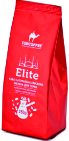

[]: # Різні стани товару


# Айтем продукту
стандартний айтем 

```
 <div class="item">
    <div class="item-wr">
        <div class="stocks">
          <span class="new-stock_text">new</span>
            <span class="new-discount_text">Знижка</span>
        </div>
        <div class="set-favourite">
            <a href="" class=""></a>
        </div>
        <div class="img">
            <a href="">
                
            </a>
        </div>
        <p class="item-title">
            <a href="" title="" tabindex="0">Кава мелена Elite</a>
        </p>
        <div class="middle-block">
            <div class="rating" data-rate="50">
                <span class="rateStarPopup"></span>
                <span class="rateStarPopup"></span>
                <span class="rateStarPopup"></span>
                <span class="rateStarPopup"></span>
                <span class="rateStarPopup"></span>
            </div>

        </div>
        <div class="not-available-block">
            <p>немає в наявності</p>
            <a href="">Повідомити про наявність</a>
        </div>
        <div class="item-kinds colors">
           <a href="#" class="state-active"><span style="background: #979A9A"></span></a>
            <a href="#" class=""><span style="background: #979A9A"></span></a>
             <a href="#" class=""><span style="background: #979A9A"></span></a>
        </div>
        <div class="item-kinds weights">
            <a href="" class=""><span>0.1 кг</span></a>
            <a href="" class=""><span>0.25 кг</span></a>
            <a href="" class="state-active"><span>1 кг</span></a>
        </div>

        <div class="bottom-block">
            <div class="product-counter-prices">
                <div class="counter">
                    <button class="minus" tabindex="0">-</button>
                    <input type="text" id="" value="1" name="" data-step="1" inputmode="numeric" tabindex="0">
                    <button class="plus" tabindex="0">+</button>
                </div>
                <div class="product-prices">
                    <p class="product-price">182 <span>грн</span></p>
                    <div class="product-price-old">
                        <div class="product-price-old-container">
                            <p>210 <span>грн</span>
                            </p>
                        </div>
                    </div>
                </div>
            </div>
            <button class="add-to-cart">
            </button>
        </div>
        <button class="make-order">Замовити</button>

    </div>
 </div>
```
---
# Різні стани товару
Все керується додаванням класу до div.item

- клас pr__origin - товар без кольорів і різних фасувань
- клас pr__weight - товар з різними фасуваннями
- клас pr__colors - товар з різними кольорами 
- клас not-available - робить товар неактивним (немає в наявності)
- клас discount - Показує маркер що товар зі знижкою.  відображає акційну і стару ціну
- клас pr_new - показує маркер *новинка*


На картинці показано можливі варіанти вигляду товару, а в списку класи які треба додати.
По дефолту має завжди бути клас item і якись з нище перелічених(без них товар буде криво відображатись):

1) pr__origin має вийти ```<div class="item pr__origin">```
2) pr__weight not-available має вийти ```<div class="item pr__weight not-available">```
3) pr__colors має вийти ```<div class="item pr__colors">```
4) pr__weight має вийти ```<div class="item pr__weight">```
5) pr__colors not-available має вийти ```<div class="item pr__colors not-available">```
6) pr__origin not-available має вийти ```<div class="item pr__origin not-available">```
 
 
---
# блок з акціями (*червоні маркери на товарі)
Поки що було тільки 2 акційні маркери знижка і новинка. 
```
<div class="stocks">
   <span class="new-stock_text">new</span>
   <span class="new-discount_text">Знижка</span>
</div>
```
---
# Рейтинг товару
в data-rate вставляти рейтинг у % (в прикладі 50%) далі js-ом все обробиться
```
<div class="middle-block">
            <div class="rating" data-rate="50">
                <span class="rateStarPopup"></span>
                <span class="rateStarPopup"></span>
                <span class="rateStarPopup"></span>
                <span class="rateStarPopup"></span>
                <span class="rateStarPopup"></span>
            </div>
</div>
```
---
# Неактивний товар
Блок який відобразиться коли товар неактивний
```
 <div class="not-available-block">
            <p>немає в наявності</p>
            <a href="">Повідомити про наявність</a>
        </div>
```    
нище по коду буде ще кнопка 
 
```
<button class="make-order">Замовити</button>
```
---

# Блок з кольором і вагою

цей блок відповідає за різновиди кольору. в span в style треба закидувати колір товару

Клас state-active в <a> показує якого кольору товар відображається.( в дизайні кружочок активного кольору має активний стан.) 

```
<div class="item-kinds colors">
            <a href="#" class="state-active"><span style="background: #979A9A"></span></a>
            <a href="#" class=""><span style="background: #979A9A"></span></a>
             <a href="#" class=""><span style="background: #979A9A"></span></a>
 </div>
```
 
цей блок відповідає за різновид по масі упакування      
Клас state-active в <a> показує якої фасовки товар зараз відображається( в дизайні цифра 'активної' фасовки має активний стан.) 

```
        <div class="item-kinds weights">
            <a href="" class=""><span>0.1 кг</span></a>
            <a href="" class=""><span>0.25 кг</span></a>
            <a href="" class="state-active"><span>1 кг</span></a>
        </div>
```

Ці два блоки можна відображати одночасно, css сховає лишнє

---

# Ціна товару
в div.product-price-old-container стара ціна. в div.product-price актуальна ціна. якщо немає акції то відображається ціна в div.product-price
```
<div class="product-prices">
                    <p class="product-price">182 <span>грн</span></p>
                    <div class="product-price-old">
                        <div class="product-price-old-container">
                            <p>210 <span>грн</span>
                            </p>
                        </div>
                    </div>
 </div>
 ```
# Інше
в кінці футера, перед скріптами є section.text-templates
в цьому блоці шаблони для підсказок в товарі (наведи на сердечко, кошик). Вивів це в html для зручності переводу на різні мови
